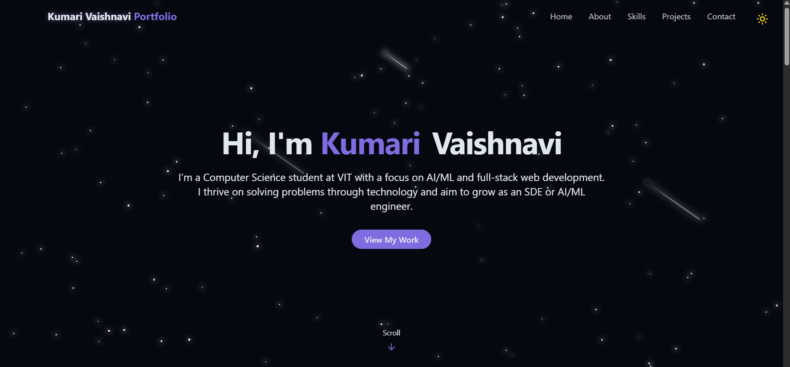
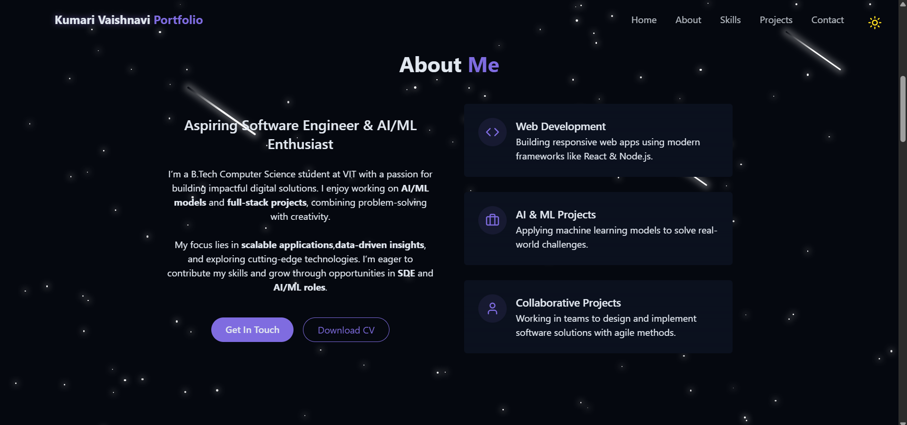
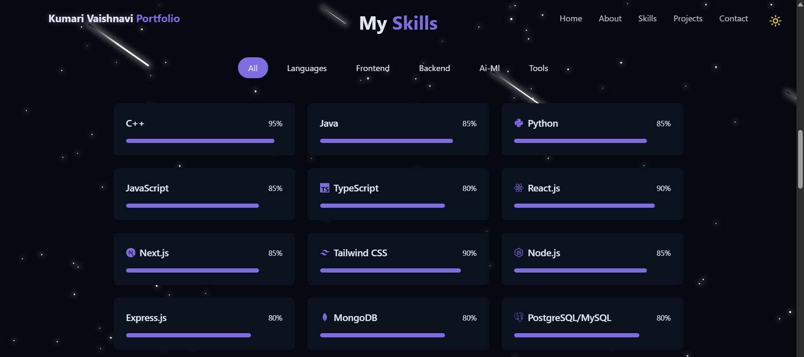
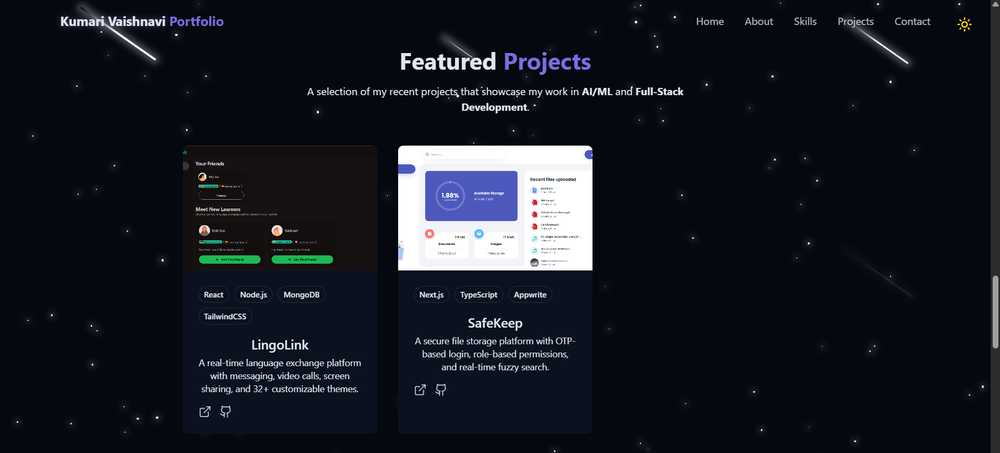
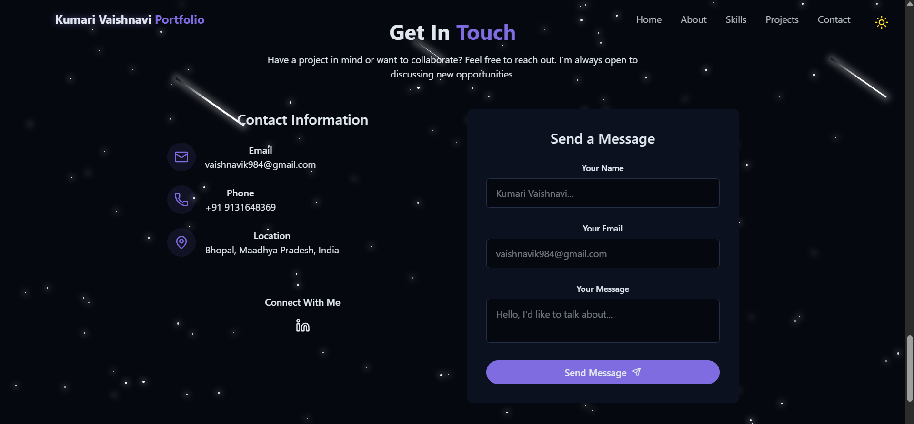

# Kumari Vaishnavi - Portfolio
A personal portfolio website built with React, TailwindCSS, and modern web tools to showcase my projects, skills, and achievements.

## About
This is my personal portfolio website where I highlight my **projects, technical skills, achievements, and experience**.  
The goal is to create a clean, modern, and responsive design that reflects both professionalism and creativity.  

## Features
- Responsive design for desktop & mobile
- Light/Dark theme toggle
- Interactive skills dashboard
- Featured projects with GitHub/demo links
- Smooth animations with Framer Motion
- Contact section with direct links

## Preview

## Live Demo
[Click here to view the website](https://portfolio-beta-five-zlk4pkv34x.vercel.app/)
